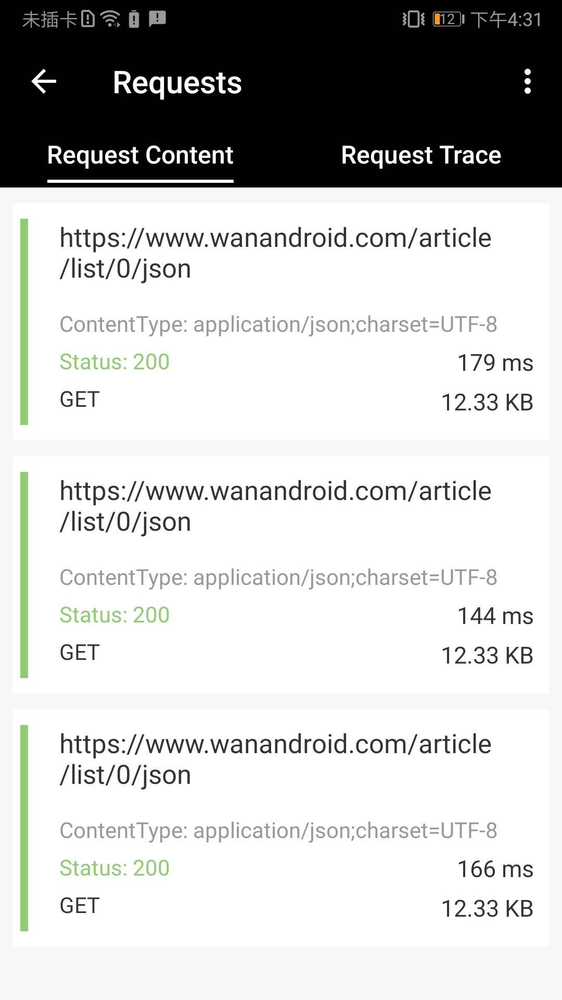
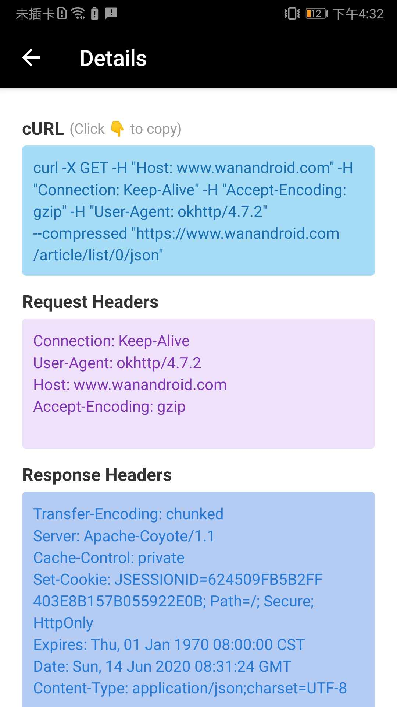
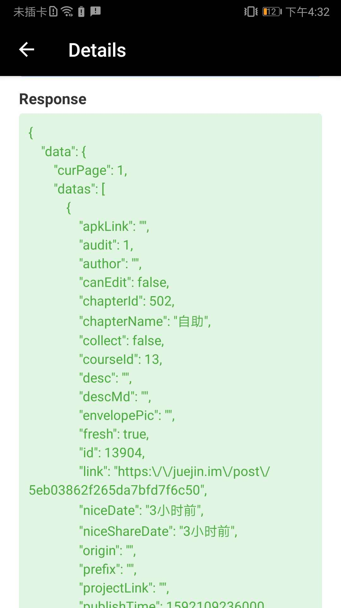
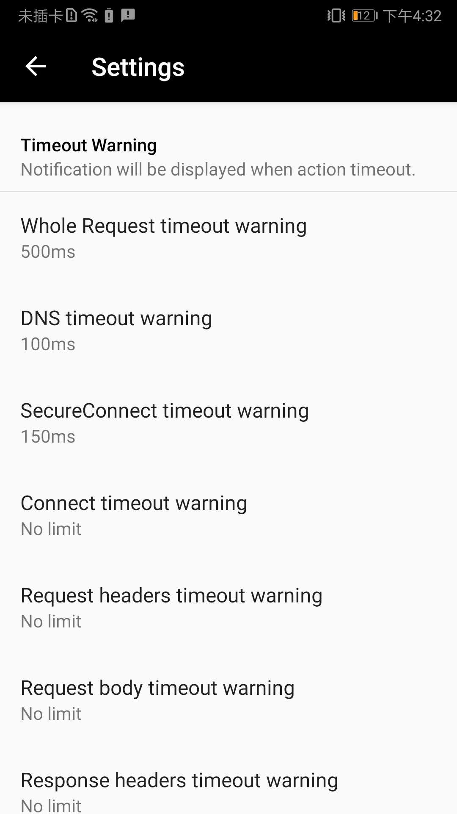
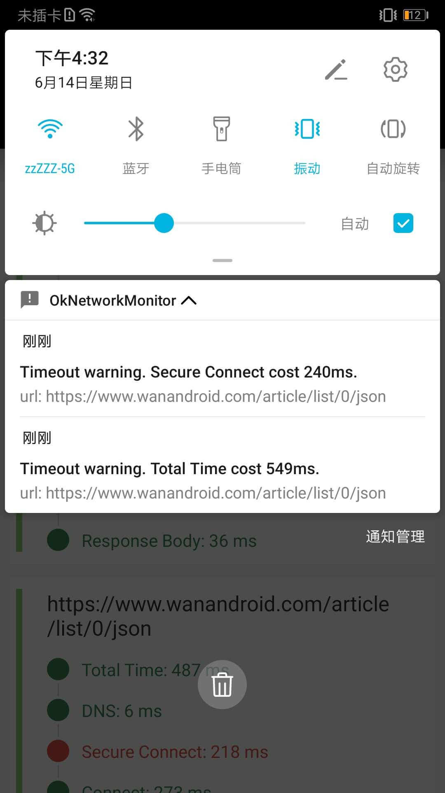

# OkNetworkMonitor

A network monitor for okHttp.

- View the request header, response header, response body and so on of a network request.
- Copy request in CURL format;
- Network request time-consuming monitoring. Timeout warning.


## Usage

### Import the lib to your project.

`implementation project(':lib-ok-network-monitor')`

### Add a network Interceptor for `OkHttpClient`

```
new OkHttpClient.Builder()
    .addNetworkInterceptor(new OkNetworkMonitorInterceptor())

```

### Network request time-consuming monitoring

```

new OkHttpClient.Builder()
    .eventListenerFactory(NetworkEventListener.Companion.getFACTORY())

```

### Entrance

#### 1.Start activity

```
NetworkFeedActivity.start(this);
```

#### 2.OR

You can find the entrance in your launcher.


## Screenshots

### Detail. Copy request in CURL format.

  

### Timeout warning. Showing in notification.

  


## LICENSE

MIT