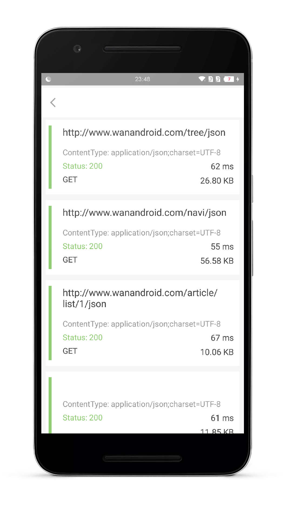
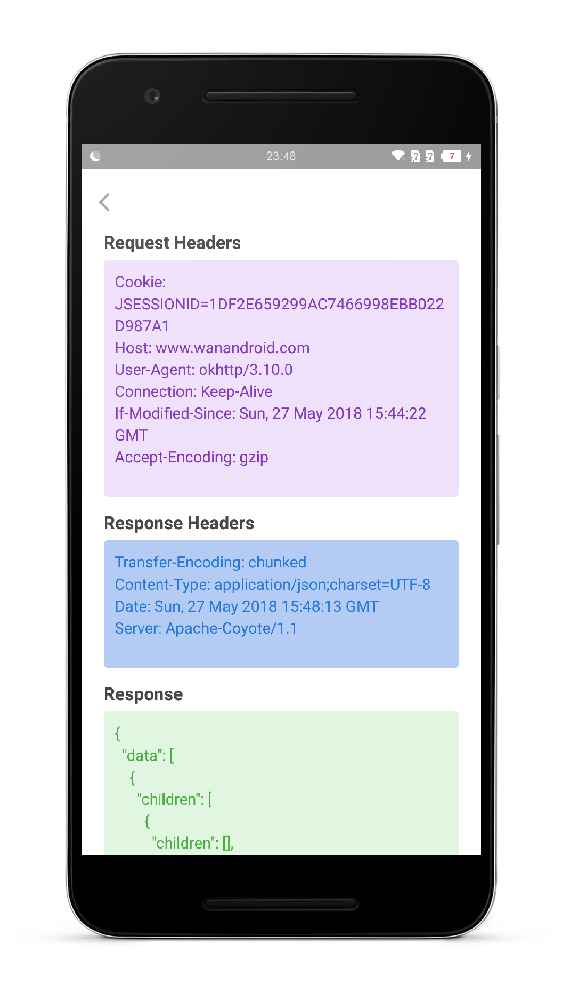
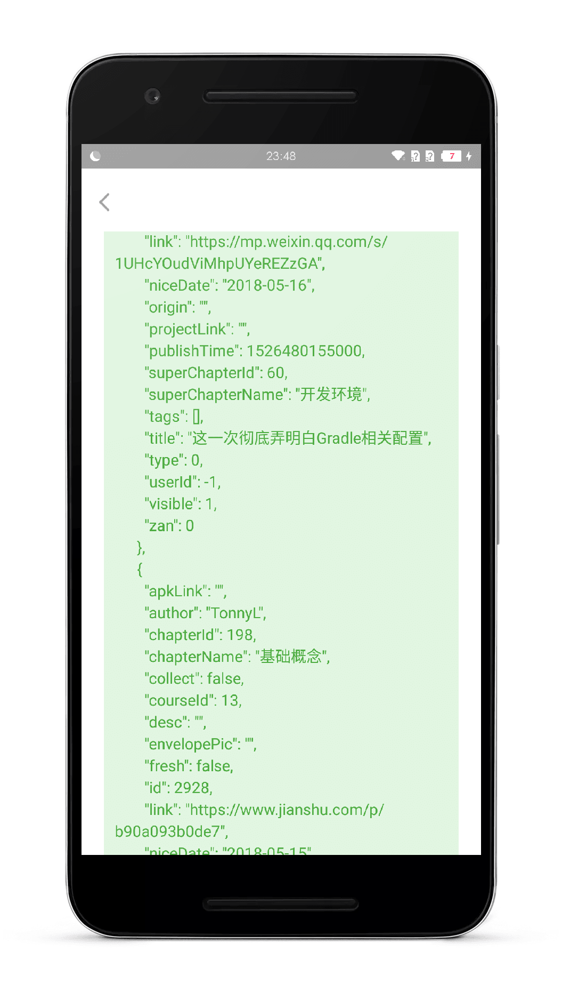

# OkNetworkMonitor

一个基于 stetho 的 OKhttp 抓包工具，可以实现在手机上面的抓包，可以方便平时开发中的调试。

目前可以看到 请求头、响应头、响应数据 等，后续还会再增加。

## 使用

### 导入

`implementation project(':lib-ok-network-monitor')`

### 添加一个拦截器

```

new OkHttpClient.Builder()
    .addNetworkInterceptor(new OkNetworkMonitorInterceptor())
    
```

### 入口

#### 1.跳到抓包页面

```
NetworkFeedActivity.start(this);
```

#### 2.或者桌面快捷入口




## 截图

  


## LICENSE

```
Copyright 2015 linkaipeng

Licensed under the Apache License, Version 2.0 (the "License");
you may not use this file except in compliance with the License.
You may obtain a copy of the License at

<http://www.apache.org/licenses/LICENSE-2.0>

Unless required by applicable law or agreed to in writing, software
distributed under the License is distributed on an "AS IS" BASIS,
WITHOUT WARRANTIES OR CONDITIONS OF ANY KIND, either express or implied.
See the License for the specific language governing permissions and
limitations under the License.

```
